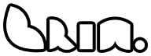

   
 𝔹𝕣𝕒𝕚𝕟 𝕀𝕟𝕕𝕦𝕤𝕥𝕣𝕪 
 <!--  -->

## 📖 Introduction

Hi!✨ I'm **Yutaka Sengoku** from **BrIn🧠** designer🖌, developer🖥, and author✍🏻.  

 
I have a motivation what ***help someone*** do with **facing-insufficiency**, stuck on, who don't know **where to start.**  
My almost works(tools) are made for ones convenience, improve environments, and decrease overtime works or something. 
(including some jokes and pranks or ironic minds.)

donations are always welcome via ko-fi! 

## 💪🏻 Experiences 

**Web / Programming** &emsp; ┅┅ &emsp;

[][bs]
[][ts]
[][vue]

**Desigining** &emsp; ┅┅┅┅┅┅┅┅┅┅┅ &emsp;

[][ase]

<!-- Links -->
[bs]: https://getbootstrap.com/
[ts]: https://www.typescriptlang.org/
[vue]: https://vuejs.org/index.html
[ase]: https://www.aseprite.org/

&emsp; &emsp; &emsp; &emsp; &emsp; ------------------------------------------------------------   
I've develop in [![win]](#) with [![vsc]](#) and [![ato]](#), involving web design and UXdesigning.  
usual UXdesign via  [![axd]](#), UI and another design with [![aps]](#) and [![aai]](#)  
some (web) experience designed by [![aae]](#)  and [![apr]](#) .  
interested in design with marketing.  
In addition, enjoying pixelart.  

<!-- icon Links -->
[vsc]:  https://img.shields.io/badge/VSCode-007ACC?style=flat&logo=VisualStudioCode&logoColor=white
[ato]: https://img.shields.io/badge/Atom-66595C?style=flat&logo=Atom&logoColor=white
[win]: https://img.shields.io/badge/Windows-0078D6?style=flat&logo=windows&logoColor=white
[axd]: https://img.shields.io/badge/XD-FF61F6?style=flat&logo=adobeXD&logoColor=white
[aps]: https://img.shields.io/badge/PhotoShop-31A8FF?style=flat&logo=adobePhotoShop&logoColor=white
[aai]: https://img.shields.io/badge/Illustrator-FF9A00?style=flat&logo=adobeIllustrator&logoColor=white
[apr]: https://img.shields.io/badge/Premiere-22042C?style=flat&logo=adobePremierePro&logoColor=white
[aae]: https://img.shields.io/badge/Aftereffects-9999FF?style=flat&logo=adobeAftereffects&logoColor=white

****

## 📊 Stats

<!--

-->
